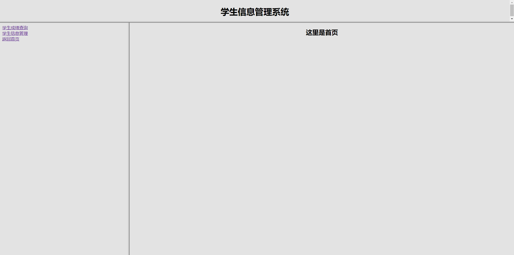
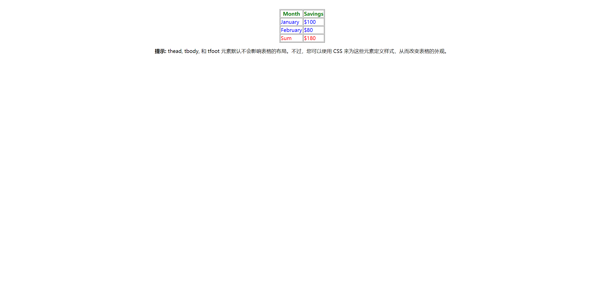

# Java EE HTML 课堂实验1：HTML 应用


## 实验内容
将所有 HTML 文件放在同一个文件夹中，直接用浏览器打开 index.html，显示如下内容：


## 关键标签
   * **FormTable.html**
   ```html
   1. <hr align="center" size="2" width="300"> // 分割线
   2. <form action="" method="POST"> 包含第3. </form>
   3. <table border="1" width="400" cellpadding="1" cellspacing="1"> // 表格标签
                <tr> // 行标签
                    <td>姓名: </td> // 单元格标签
                    <td><input type="text" name="username" maxlength="10" size="21"></td>
                </tr>
    --------------------------------------------------------------            
                <tr>
                    <td>密码: </td>
                    <td><input type="password" name="pwd" size="21"></td>
                </tr>
    --------------------------------------------------------------
                <tr>
                    <td>专业: </td>
                    <td>
                        <select name="major" id="" size="1"> // 下拉列表
                            <option value="计算机">计算机</option>
                            <option value="英语">英语</option>
                            <option value="数学">数学</option>
                        </select>
                    </td>
                </tr>
    -------------------------------------------------------------
                <tr>
                    <td colspan="2" align="center">   // 合并单元格
                    <input type="submit" value="提交" align="center"> // 按钮
                    <input type="reset" value="重置" align="center">
                    </td>
                </tr>
   ```
   * **head.html**
   ```html
   // 灰色背景，整体居中
   <body bgcolor="#E3E3E3">
    <center><h1>学生信息管理系统</h1></center>
</body>
   ```
   * **left.html**
   ```html
   // 超链接 a，换行 br
   <body bgcolor="#e3e3e3">
    <a href="table.html" target="right">学生成绩查询</a><br> // 属性 target 指定内容在框架的左右位置
    <a href="FormTable.html" target="right">学生信息管理</a><br>
    <a href="video.html" target="right">学生存的小片子</a><br>
    <a href="right.html" target="right">返回首页</a><br>
</body>
   ```
   * **table.html**
   ```html
   <table border="1" bgcolor="yellow" width="500">
        <caption>学生成绩表</caption>
        <tbody> // 有 thead、tbody、tfoot，可以分别定义表格头、身、尾
            <tr bgcolor="silver">
                <th>专业</th> // 表格字段标签 th
                <th>学号</th>
                <th>姓名</th>
                <th>计算机导论</th>
                <th>数据结构</th>
                <th>数据库原理</th>
            </tr>
            <tr>
                <td rowspan="3">计算机</td> // 第一个单元格合并3行
                <td>051101</td>
                <td>王&nbsp;&nbsp;林</td> // &nbsp 表示空格
                <td align="center">80</td>
                <td align="center">78</td>
                <td align="center">90</td>
            </tr>
        </tbody>
   ```
   * **video.html**
   ```html
   // HTML5 新增标签 video
   <body align="center">
    <video width="640" height="480" controls loop> // controls 属性允许用户使用播放等按钮
        <source src="movie.mp4" type="video/mp4">
    </video>
</body>
   ```
   ***
## CSS 设计 thead、tbody、tfoot
```html
<!DOCTYPE html>
<html>

    <head>
        <meta charset="utf-8"> 
        <title>CSStest</title> 
        <style type="text/css">
            thead {
                color: green;
            }

            tbody {
                color: blue;
            }

            tfoot {
                color: red;
            }
        </style>
    </head>

    <body>

        <table border="1">
            <thead>
                <tr>
                    <th>Month</th>
                    <th>Savings</th>
                </tr>
            </thead>
            <tfoot>
                <tr>
                    <td>Sum</td>
                    <td>$180</td>
                </tr>
            </tfoot>
            <tbody>
                <tr>
                    <td>January</td>
                    <td>$100</td>
                </tr>
                <tr>
                    <td>February</td>
                    <td>$80</td>
                </tr>
            </tbody>
        </table>

        <p><b>提示:</b> thead, tbody, 和 tfoot 元素默认不会影响表格的布局。不过，您可以使用 CSS 来为这些元素定义样式，从而改变表格的外观。</p>

    </body>

</html>
```
运行结果如下：
